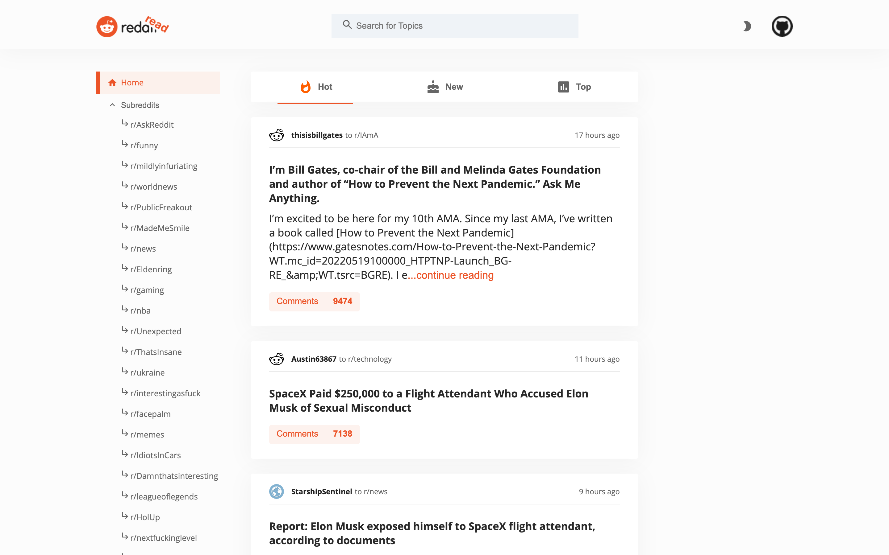

# Read Reddit App

This is training project for Codecademy course (Frontend engineer). The goal of this project: create app where you can read through reddit posts and comments, filter and search them.

[Live Version](https://read-reddit.netlify.app/).

## Preview

## Technologies

* React & Redux
* React Router
* HTML, CSS, JavaScript

## Features

* Initial rendering of posts from 'r/popular' subreddit
* Searchbar
* You can filter posts by 'HOT', 'NEW' or 'TOP'
* See comments under posts
* You can directly visit listed subreddits
* Day/Night switch mode
* Animations and user friendly flow when browsing through the app

## Limits

* This App' screen is currently designed only for desktop users. Practice with media queries wasn't a goal for me here.
* There are no tests right now.
